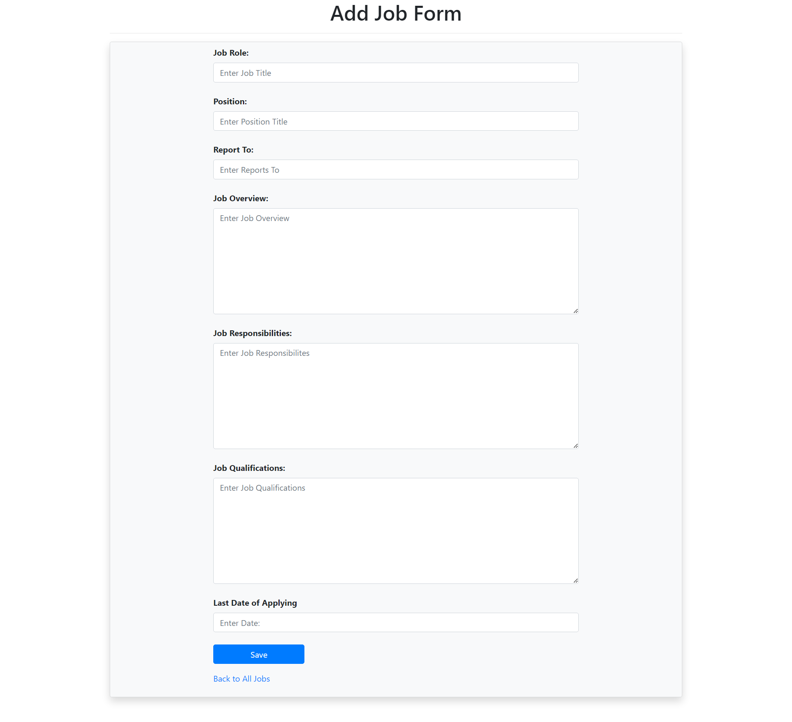

# Recruitment-portal
***
This is a personal project with role based access control facilty where there are two portals for two roles.Employers can access the admin portal and add-delete-edit jobs which are visible to the applicants portal
    
## About The Project
***
The project us built with Spring Boot with Spring Data JDBC, Spring Security and Thymeleaf.
The project has jwt token auth feature generated with SHA-256 algorithm. Below are the hands on snapshots of the project.

**Login Page:**

**Home Page:**

**Admin Portal:**

**Add Job:**

**Job Details**

## Database Design
***
For the database **MySQL** database is used with the following design

